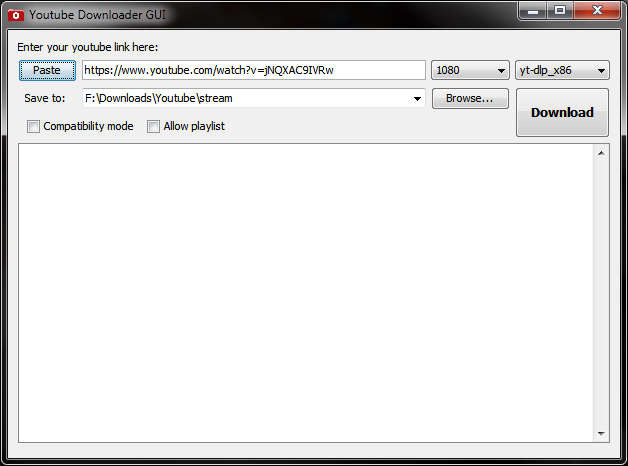

# ytdl-gui

Lightweight GUI for youtube-dl video downloader or compatible fork.

## Installation for Windows
1. make sure Java 8+ is installed
2. create new folder (ex: `c:\VideoDownloader`)
2. download project JAR file
3. download [yt-dlp](https://github.com/yt-dlp/yt-dlp) or [youtube-dl](https://ytdl-org.github.io/youtube-dl/) executable
4. download [ffmpeg](https://ffmpeg.org/) executable

## Run
Doubleclick on JAR file or:

`java -jar ytdl-gui.jar`

## Update GUI

- Just download new JAR file to previous folder (ex: `c:\VideoDownloader`).

## Update downloader executable

- Run programm from JAR file.
- Right click at downloader combo box.
- Select Update Downloader in popup menu.